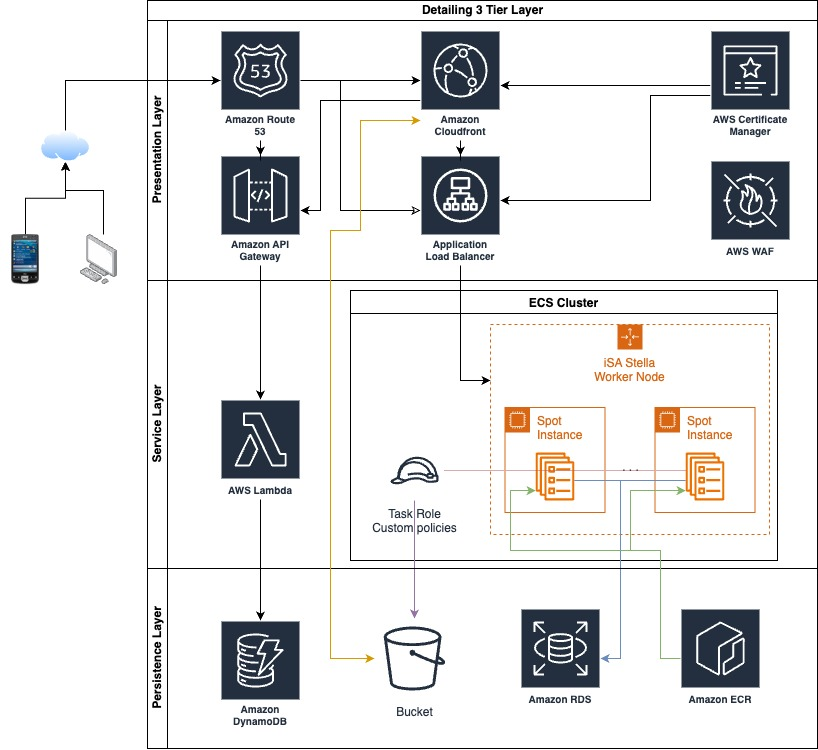

# Website

## Tech stack

The website is built using NextJS 14 and is set to generate a static export when the build is run.
This project uses typescript. Styles are handled by tailwindcss.

## Development

Website code is under `articul8` folder. NodeJS is required.
Run `npm i` to install the dependencies, and then `npm run dev` to spin up the development server. 

The website reloads automatically when any files are changed.

Static assets are stored unders `/articul8/public` folder. When adding an image, save it to this folder, and on the img html tag, set 
the src as `` 

Before commiting the code with changes, run `npm run build` to make sure there are no issues in generating the static export.

## Deployment

The deployment is handled by the github actions pipeline whenever a branch is merged into the `dev` branch.

# SES Configuration Instructions

This service requires SES configuration: 

1. In the AWS console, open SES and verify the email addresses and/or domains. 
2. In the file `index.mjs` set the constants `EMAIL_SOURCE` and `EMAIL_DESTINATION` 
   accordingly (e.g. new_contact@articul8.com, info@articul8.com). 

# Infra

### Infra Complementary steps
When running for the first time this deployment please run the following steps:

1. Go to https://us-east-1.console.aws.amazon.com/apigateway/main/publish/domain-names?region=us-east-1
2. Click on "api.whimsicalquantumwidgetry.site"
3. Then on tab: Api mappings
4. Click on "Configure API mappings"
5. Select the API that has been deployed and the `$default` stage
6. Click "Save"
   
This will allow the API to be accessible from the custom domain name.

use the following command to test the API:

```bash
curl -X POST -H "Content-Type: application/json" -d '{"name":"John Doe", "email": "renato.gn@gmail.com", "company":  "Test Company" }' https://api.articul8.ai/contact-us
```

Or use Postman to test the collection.


## How to Deploy

The deployment process is automated and can be triggered by merging the following PR:
After configuring the state manager / terraform backend, copy the file generated by the state manager with following information. 

> [!CAUTION]
> Bellow is only and example please use the file generated by the state manager.

```bash
# Folder structure
tree iac/terraform/backend
.
iac/terraform/backend
└── a8
    └── us-east-1
        ├── dev.tfvars
        └── prd.tfvars

# Example of the file content

cat  iac/terraform/backend/a8/us-east-1/dev/strapi-service.tfstate
bucket         = "a8-dev-tfstate-bla-bla" 
dynamodb_table = "a8-site-tfstatemgnt-bla-bla"
region         = "us-east-1"
# this should match the client/region/env/service name structure of the folder
key            = "a8/us-east-1/dev/strapi-service.tfstate"
```

To the folder `iac/terraform/backend` commit it and push it to the repository.
Open the PR check if the state changes are expected and them merge it.
This merge command is your approval on changes to be executed in the infrastructure, and therefore deploying the Strapi CMS to the ECS cluster.


## Infrastructure components

The Strapi CMS is hosted on ECS at AWS account that should be in placed after running the initial setup from infrastructure repo. 
The infrastructure repo is located at the following link: [Infrastructure](https://github.com/shaojiDV/infrastructure)

### How to Deploy

Even that the infrastructure can be deployed using the pipeline in this repo, is necessary to have the ECR repo previously created using the terraform code by running:
```bash
cd iac/terraform

```
, you will need to deploy the Strapi CMS to the ECS cluster. 
The deployment process is automated and can be triggered by merging the following PR:


## Diagram

The diagram below illustrates the architecture of overhal solutions and its integration with the frontend application.

# learn-action
